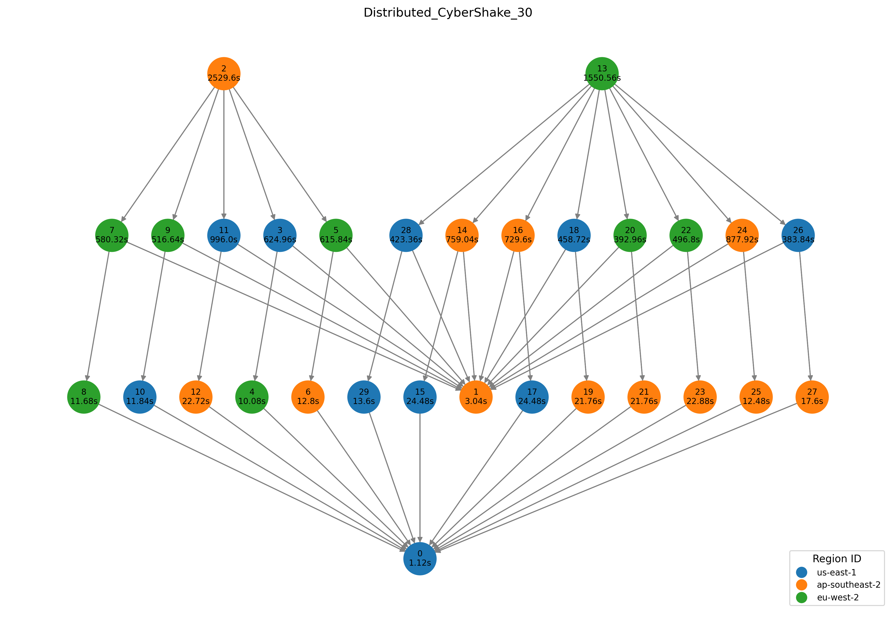

## Dynamic multi-workflow scheduling for geo-distributed cloud services: an evolutionary reinforcement learning approach
#### Master of Artificial Intelligence thesis submission by Chuan Law
#### AIML501 + AIML589


### Pre-reqs
- Python must be installed on your computer environment.
- Run `pip install -r requirements.txt` to download all needed dependencies if applicable.

### Usage
TBC
```buildoutcfg
python eval_rl.py
```

### Notes
